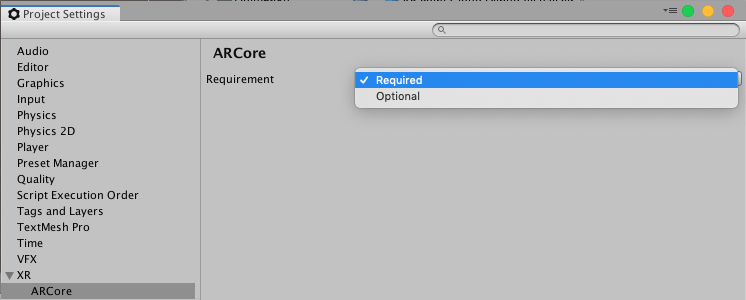

# About ARCore XR Plugin

Use the *ARCore XR Plugin* package to enable ARCore support via Unity's multi-platform XR API. This package implements the following XR Subsystems:

* [Session](https://docs.unity3d.com/Packages/com.unity.xr.arsubsystems@3.1/manual/session-subsystem.html)
* [Camera](https://docs.unity3d.com/Packages/com.unity.xr.arsubsystems@3.1/manual/camera-subsystem.html)
* [Depth](https://docs.unity3d.com/Packages/com.unity.xr.arsubsystems@3.1/manual/depth-subsystem.html)
* [Input](https://docs.unity3d.com/2018.1/Documentation/ScriptReference/Experimental.XR.XRInputSubsystem.html)
* [Planes](https://docs.unity3d.com/Packages/com.unity.xr.arsubsystems@3.1/manual/plane-subsystem.html)
* [Raycast](https://docs.unity3d.com/Packages/com.unity.xr.arsubsystems@3.1/manual/raycast-subsystem.html)
* [Anchors](https://docs.unity3d.com/Packages/com.unity.xr.arsubsystems@3.1/manual/anchor-subsystem.html)
* [Face Tracking](https://docs.unity3d.com/Packages/com.unity.xr.arsubsystems@3.1/manual/face-tracking.html)
* [Image Tracking](https://docs.unity3d.com/Packages/com.unity.xr.arsubsystems@3.1/manual/image-tracking.html)
* [Environment Probes](https://docs.unity3d.com/Packages/com.unity.xr.arsubsystems@3.1/manual/environment-probe-subsystem.html)

This version of *ARCore XR Plugin* uses ARCore 1.12 and supports the following functionality:

* Device Localization
* Horizontal Plane Detection
* Vertical Plane Detection
* Point Clouds
* Pass-through Camera View
* Light Estimation
* Anchors
* Oriented Feature Points
* Hit Testing
* Session Management
* ARCore Apk On-Demand Installation
* Image tracking
* Face tracking
* Environment Probes

It does not support the following subsystems:

* [Object Tracking](https://docs.unity3d.com/Packages/com.unity.xr.arsubsystems@3.1/manual/object-tracking.html)

# Installing ARCore XR Plugin

To install this package, follow the instructions in the [Package Manager documentation](https://docs.unity3d.com/Packages/com.unity.package-manager-ui@latest/index.html).

In addition, you will likely want to also install the *AR Foundation* package which makes use of *ARCore XR Plugin* package and provides many useful scripts and prefabs.

For more information on the *AR Foundation* package, please read the [AR Foundation Documentation](https://docs.unity3d.com/Packages/com.unity.xr.arfoundation@3.1).

# Using ARCore XR Plugin

The *ARCore XR Plugin* implements the native endpoints required for building Handheld AR apps using Unity's multi-platform XR API. However, this package does not expose any public scripting interface of its own and most developers should use the scripts, prefabs, and assets provided by *AR Foundation* as the basis for their Handheld AR apps.

Inclusion of the *ARCore XR Plugin* will result in the inclusion of source files, static libraries, shader files, and plugin metadata.

## Build Settings

ARCore may be either "required" or "optional". If ARCore is optional, the Play Store will allow your app to be installed on a device that does not support ARCore, or where ARCore may be supported but not installed. This is useful if you want to provide an experience which uses AR where available, and presents a different experience where AR is not available. By default, AR is required. To create an `ARCoreSettings` asset and assign it to your build settings, click _Edit > Project Settings_ then navigate to _XR > ARCore_:



**Note:** If ARCore is "required", then the availability check will always report that ARCore is supported, _even on unsupported devices_. This is because the Play Store prevents the installation of ARCore-required apps on unsupported devices, so an ARCore-required app always assumes it is running on a supported device. However, if you install an Android APK onto an unsupported device via USB (called "side loading") or via Unity, the unsupported device will report that ARCore is supported.

## Session

See the [ARSubsystems Session](https://docs.unity3d.com/Packages/com.unity.xr.arsubsystems@3.1/manual/session-subsystem.html) documentation. ARCore's implementation of `XRSessionSubsystem.GetAvailabilityAsync` is somewhat complex. The list of supported ARCore devices is frequently updated to include additional devices, so if ARCore is not already installed on the device, the app needs to check with the Play Store to see if there is a version of ARCore which supports that device. `GetAvailabilityAsync` returns a `Promise` which can be used in a coroutine. For ARCore, this check may take some time.

If the device is supported, but ARCore is not installed (or requires an update), then you will need to call `XRSessionSubsystem.InstallAsync` which again returns a `Promise`.

## Depth Subsystem

See the [ARSubsystems Depth Subsystem](https://docs.unity3d.com/Packages/com.unity.xr.arsubsystems@3.1/manual/depth-subsystem.html) documentation for more details. Raycasts always return a `Pose` for the item the raycast hit. When raycasting against feature points, the pose is oriented to provide an estimate for the surface the feature point might represent.

The depth subsystem does not require additional resources, so enabling it does not incur any performance impact.

ARCore's depth subsystem will only ever produce a single [`XRPointCloud`](https://docs.unity3d.com/Packages/com.unity.xr.arsubsystems@3.1/api/UnityEngine.XR.ARSubsystems.XRPointCloud.html).

## Plane Tracking

See the [ARSubsystems Plane Subsystem](https://docs.unity3d.com/Packages/com.unity.xr.arsubsystems@3.1/manual/plane-subsystem.html) documentation for more details. ARCore supports plane subsumption, i.e., one plane may be subsumed by another. When this happens, the subsumed plane will not be removed, but will also not be updated any further.

ARCore provides boundary points for all its planes.

The ARCore plane subsystem requires additional CPU resources and can be energy intensive. Enabling both horizontal and vertical plane detection requires additional resources. Consider disabling plane detection when not needed to save energy.

Setting the plane detection mode to `PlaneDetectionMode.None` is equivalent to `Stop`ping subsystem.

## Image Tracking

To use image tracking on ARCore, you will first need to create a Reference Image Library. See the [AR Subsystems documentation on image tracking](https://docs.unity3d.com/Packages/com.unity.xr.arsubsystems@3.1/image-tracking.html) for instructions.

When building the Player for Android, each reference image library is used to generate a corresponding `imgdb` file, ARCore's representation of the reference image library. These files are placed in your project's `StreamingAssets` folder in a subdirectory called `HiddenARCore` to allow them to be accessible at runtime.

ARCore's AR Reference Images can be either JPEG or PNG files. If a different type of source texture is specified in the `XRReferenceImageLibrary`, then the ARCore build processor will attempt to convert the texture to a PNG for ARCore to use. Exporting a `Texture2D` to PNG can fail for several reasons. For instance, the texture must be marked both readable and uncompressed in the texture importer settings. Note that if you plan to use the texture at runtime (and not just as a source asset for the reference image), you should create a separate PNG or JPEG as the source asset, since those texture import settings can have undesirable performance or memory impacts at runtime.

### Reference Image Dimensions

Image dimensions are optional on ARCore; however, specifying them can improve image detection. If you specify the dimensions for a reference image, only the image's width is provided to ARCore. It computes the height from the image's aspect ratio.

## Face Tracking

See the [ARSubsystems Face Tracking](https://docs.unity3d.com/Packages/com.unity.xr.arsubsystems@3.1/manual/face-tracking.html) documentation for more details regarding face tracking.

In addition to the core functionality, there are additional methods on the ARCore face subsystem to allow access to ARCore-specific features. ARCore provides access to "regions", which are specific features on a face. Currently, the features are
- Nose tip
- Forehead left
- Forehead right

Each region has a `Pose` associated with it. To access face regions, you'll need to obtain an instance of the `ARCoreFaceSubsystem`:
```csharp
XRFaceSubsystem faceSubsystem = ...
#if UNITY_ANDROID
var arcoreFaceSubsystem = faceSubsystem as ARCoreFaceSubsystem;
if (arcoreFaceSubsystem != null)
{
    var regionData = new NativeArray<ARCoreFaceRegionData>(0, Allocator.Temp);
    arcoreFaceSubsystem.GetRegionPoses(faceId, Allocator.Temp, ref regionData);
    using (regionData)
    {
        foreach (var data in regionData)
        {
            Debug.LogFormat("Region {0} is at {1}", data.region, data.pose);
        }
    }
}
#endif
```

## Light Estimation

ARCore has two modes of operation when it comes to light estimation, `LightEstimationMode.AmbientIntensity` and `LightEstimationMode.EnvironmentalHDR`.  `LightEstimationMode.AmbientIntensity` providers color correction and average pixel intensity information while `LightEstimationMode.EnvironmentalHDR` provides an estimated Main Light Direction, HDR Color, and the ambient SphericalHarmonicsL2 (see [SphericalHarmonicsL2](https://docs.unity3d.com/ScriptReference/Rendering.SphericalHarmonicsL2.html) for more information on Spherical Harmonics).  The two modes can not be used simultaneously.

Additionally, the light estimation modes either used or affected by other subsystems, namely the [ARCoreFaceSubsystem](https://docs.unity3d.com/Packages/com.unity.xr.arcore@3.1/api/UnityEngine.XR.ARCore.ARCoreFaceSubsystem.html) and the [ARCoreEnvironmentProbeSubsystem](https://docs.unity3d.com/Packages/com.unity.xr.arcore@3.1/api/UnityEngine.XR.ARCore.ARCoreEnvironmentProbeSubsystem.html).  If one or both of these subsystems is present and `enabled` the light estimation mode will have it's behaviour modified depending on the configuration.

| Functionality      | Supported Light Estimation Modes                                       | Modifiable |
|--------------------|------------------------------------------------------------------------|------------|
| Face Tracking      | `LightEstimationMode.AmbientIntensity`, `LightEstimationMode.Disabled` | Yes        |
| Environment Probes | `LightEstimationMode.EnvironmentalHDR`                                 | No         |

* Face Tracking: ARCore does not support `LightEstimationMode.EnvironmentalHDR` while face tracking and will have a black background should the estimation mode.  To prevent this, the providers will only allow `LightEstimationMode.AmbientIntensity` or `LightEstimationMode.Disabled` modes to be set while tracking faces or it will enforce `LightEstimationMode.Disabled`.

* Environment Probes: ARCore Environment Probes rely on the light estimation mode being `LightEstimationMode.EnvironmentalHDR` to surface and update the cubemap and therefore takes ownership of the setting.

## Camera Configuration

[XRCameraConfiguration](https://docs.unity3d.com/Packages/com.unity.xr.arsubsystems@3.1/api/UnityEngine.XR.ARSubsystems.XRCameraConfiguration.html) contains an `IntPtr` field `nativeConfigurationHandle` which is a platform-specific handle.  For ARCore, this handle is an integer that represents the index into the available camera configuration list surfaced through the native [ArCameraConfigList_getItem](https://developers.google.com/ar/reference/c/group/cameraconfig#group__cameraconfig_1ga4c0a09266e97b0a54cc2bd1da6c95af9) function.  Additionally, a configuration that is has a `nativeConfigurationHandle` of `-1` indicates that the configuration is the current active configuration.

# Technical details
## Requirements

This version of *ARCore XR Plugin* is compatible with the following versions of the Unity Editor:

* 2019.2 and later (recommended)

## Known limitations

* The *AR Core Supported* checkbox in the XR Settings section of the Android Player settings must remain unchecked in order for apps built with the *ARCore XR Plugin* to work properly.
* Color Temperature in degrees Kelvin is not presently supported.

## Package contents

This version of *ARCore XR Plugin* includes:

* A shared library which provides implementation of the XR Subsystems listed above
* A shader used for rendering the camera image
* A plugin metadata file
