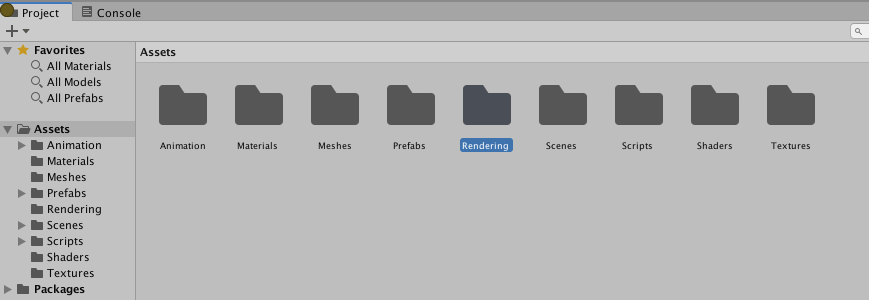

# Configuring AR Camera Background with a Scriptable Render Pipeline

AR Foundation supports the Universal Render Pipeline (URP) versions 7.0.0 or later.

Note: Projects made using URP are not compatible with the High Definition Render Pipeline or the built-in Unity rendering pipeline. Before you start development, you must decide which render pipeline to use in your Project.

See the [URP Install and Configure documentation](https://docs.unity3d.com/Packages/com.unity.render-pipelines.universal@latest?subfolder=/manual/InstallingAndConfiguringURP.html) for more details on switching to URP.

## Basic Configuration for SRP with AR Foundation
1. In the project's Assets folder, create a new folder named "Rendering".

   
2. In the Assets > Rendering folder, create a `Pipeline Asset (Forward Renderer)` for your SRP.
  - Choose Create > Rendering > Universal Render Pipeline > Pipeline Asset (Forward Renderer).
  - Note that this will create two assets: an [UniversalRenderPipelineAsset](https://docs.unity3d.com/Packages/com.unity.render-pipelines.universal@latest?subfolder=/api/UnityEngine.Rendering.Universal.UniversalRenderPipelineAsset.html) and a [ForwardRenderer](https://docs.unity3d.com/Packages/com.unity.render-pipelines.universal@latest?subfolder=/api/UnityEngine.Rendering.Universal.ForwardRenderer.html).

   
3. In the Inspector with the `ForwardRenderer` selected, add an `ARBackgroundRendererFeature` to the list of Renderer Features.

   
4. In Project Settings > Graphics, select the `UniversalRenderPipelineAsset` for the Scriptable Render Pipeline Settings field.

   
